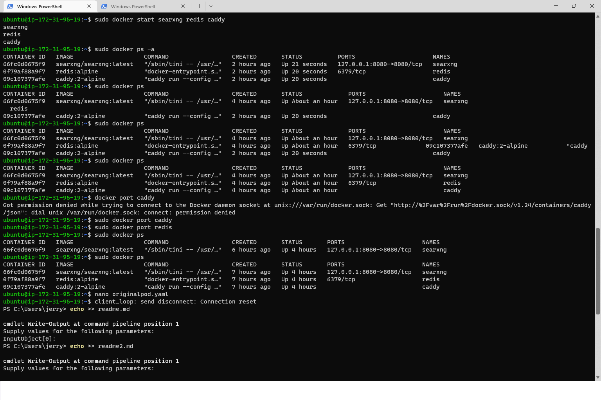
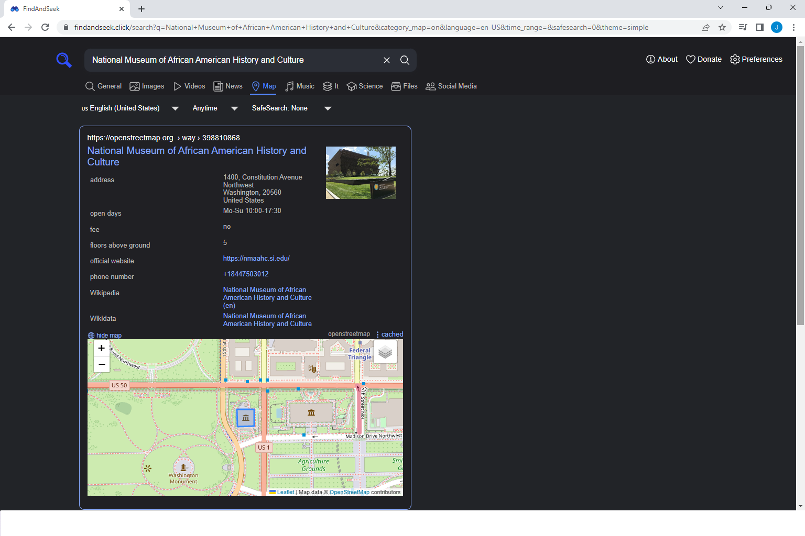

 

## Link for my search engine! (Deprecated)
https://findandseek.click   

## Project Overview
In a society where consumer data is being tracked and utilized at a high rate, search engines prioritizing individual privacy are in high demand. FindAndSeek is a solution aimed to solve this dilemma. It is a metasearch engine that finds results across different search providers without tracking the consumer's web interactions. The only demographic information that FindAndSeek records is its total amount of visitors.  

## Project Infrastructure
This project was originally configured with a Ubuntu 20.04 machine image on a "t2.micro" EC2 instance. 

Separate Docker containers for Redis, Caddy and the main web app, named "Searxng", are hosted and run on a "t3.small" EC2 instance. The "t3.small" instance was upgraded from "t2.micro" to comply with vCPU requirements for using Kubernetes. To ensure high availability for the web application the Searxng container is run inside of a Kubernetes pod with 3 pod replicas working inside the Kubernetes cluster.  

There are simpler methods that ensure high availability, such as seamlessly using the same AMI to create a configuration template for an Auto-Scaling Group or editing the Kubernetes deployment template file to provision more than 3 pod replicas. But these solutions require more cloud resources and subsequently more money. Cost was the primary driving factor when creating this highly available solution.
  

## Project Weaknesses + Plans for Version 2
While the Kubernetes cluster provides high availability for the application there is almost nothing providing high availability for the critical "t3.small" instance that runs the application in addition to the Redis container and the Caddy container. The front end is also rudimentary and lacking memorable engagement beyond the search feature.

Version 2 of FindAndSeek will have an Auto-Scaling Group with at least 1 instance per AZ and each AMI will be updated to include Kubernetes pods hosting the Redis and Caddy containers. Each cluster will be set up with its own monitoring and features designed to more closely replicate a production environment.

In terms of customer engagement and the user interface, I am currently enlisting my network to provide input on the UI and UX to improve FindAndSeek V2. If you have suggestions for ways to improve the UI or UX please email: jeramayagramby@gmail.com   

## Project Photos   
  
  
  
  
